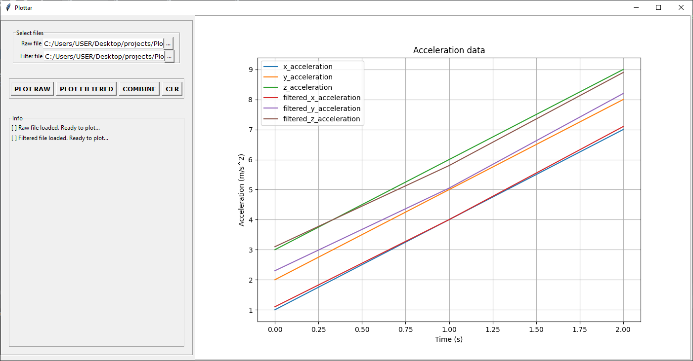

## Description
This app is a for plotting two data files from an IMU; raw data and filtered data.
It was originally designed for comparing the raw data and filtered from any inertial measurement unit(IMU)

---


---

## Usage
1. Make sure the raw data file and filtered data file is formatted as csv, with headers removed
2. To plot the raw data file, click the ```...``` button next to the raw file entry box. And click on ```PLOT RAW```
3. To plot the filtered data file, click the ```...``` button next to the filtered file entry box and click on ```PLOT FILTERED```
4. To clear the entry boxes, click the ```CLR ``` button. 
```Note
NB: The CLR button does not clear the plot axes and figure at the moment 
```


## Issues and improvements 
The following features will be implemented and improved in upcoming releases
1. Re-use the same axes for multiple plots
2. Turn on/off a plot visibility
3. User set the legends
4. User set the plot title
5. User set the axes labels
6. Include Matplotlib Nav Bar